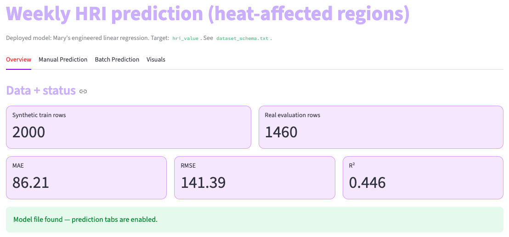
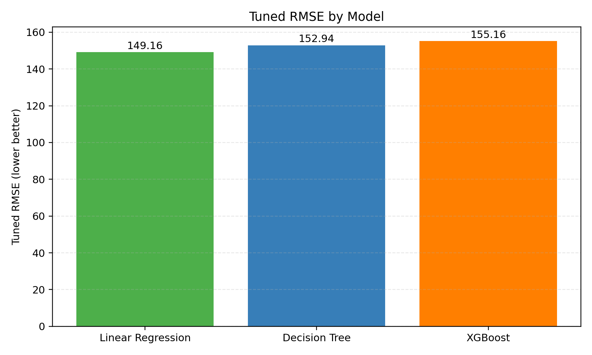
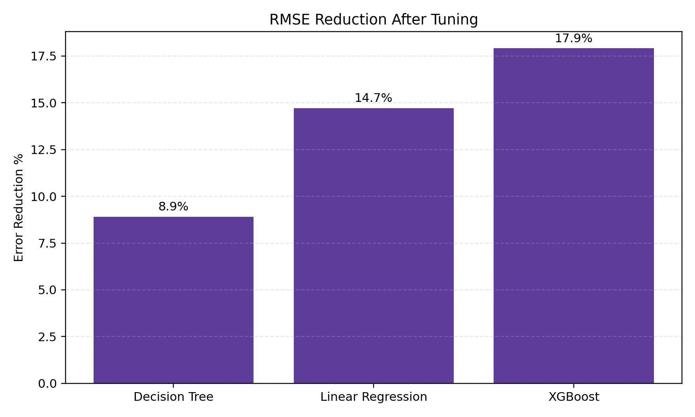
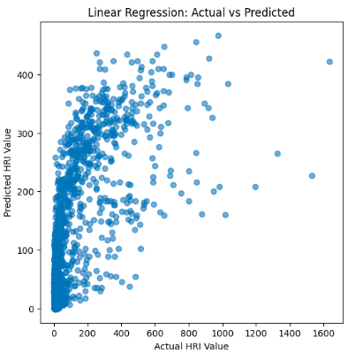
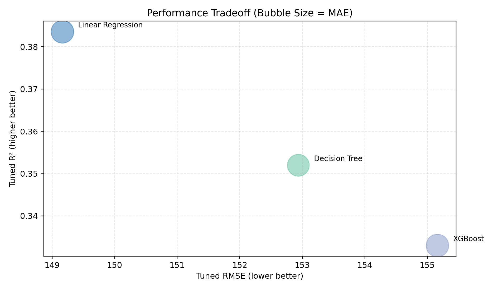
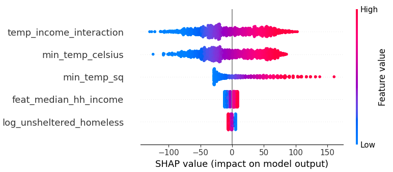

# Predicting Heat-Related Illness Risk



*Interactive machine learning and public health analytics dashboard for forecasting heat-related illness (HRI) risk across heat-prone U.S. regions.*

---

# Live Dashboard

https://predictinghri.streamlit.app/

---

# Project Overview

This project develops predictive machine learning models to estimate weekly heat-related illness (HRI) risk across heat-prone U.S. regions using environmental, socioeconomic, and public health indicators.

The analysis integrates:
- CDC Heat & Health Tracker data
- NOAA weather data
- American Community Survey (ACS) socioeconomic indicators
- HUD homelessness statistics

Multiple statistical and machine learning models were evaluated to improve:
- forecasting accuracy
- model interpretability
- healthcare applicability
- public health decision support

An interactive Streamlit dashboard was developed to visualize predictions, model performance, and regional healthcare risk patterns.

---

# Business Problem

Extreme heat events increasingly strain healthcare systems and disproportionately impact vulnerable populations.

Public health agencies and healthcare systems often face challenges in:
- anticipating surges in heat-related illness
- identifying high-risk communities
- allocating healthcare resources proactively
- understanding environmental and socioeconomic vulnerability patterns

This project addresses these challenges by building a predictive analytics framework capable of forecasting weekly HRI risk using multi-source public health data.

---

# Objectives

The primary goals of this project were to:

- Forecast weekly heat-related illness risk
- Identify key drivers of heat-related healthcare demand
- Compare statistical and machine learning modeling approaches
- Improve predictive performance through feature engineering and tuning
- Apply explainable AI techniques for healthcare interpretability
- Develop an interactive public health analytics dashboard

---

# Key Results

- Developed predictive models using integrated healthcare and environmental datasets
- Improved RMSE through feature engineering and model tuning
- Identified major drivers of heat-related illness risk using SHAP explainability analysis
- Built an interactive Streamlit dashboard for healthcare forecasting and public health planning
- Demonstrated the value of explainable machine learning for healthcare analytics

---

# Data Sources

This project integrates publicly available datasets from multiple healthcare and environmental sources.

## CDC Heat & Health Tracker
Used for:
- weekly HRI rates
- regional healthcare impact analysis
- target prediction variables

## NOAA Climate Data
Used for:
- maximum temperature
- minimum temperature
- environmental heat exposure indicators

## American Community Survey (ACS)
Used for:
- socioeconomic indicators
- income and poverty metrics
- demographic vulnerability measures

## HUD Homelessness Data
Used for:
- overall homelessness estimates
- unsheltered homelessness indicators
- population vulnerability analysis

---

# Repository Data

Processed analytical datasets used for modeling and dashboard development are included within the repository's `/data` directory.

The repository includes:
- cleaned analytical datasets
- modeling workflows
- dashboard application code
- visualizations
- explainability analyses
- project outputs

Some large raw source files used during development may be excluded due to repository size limitations.

---

# Methodology

## Data Pipeline

```text
CDC HRI Data
      ↓
NOAA Weather Integration
      ↓
ACS + HUD Socioeconomic Merge
      ↓
Feature Engineering
      ↓
Model Training
      ↓
Model Evaluation
      ↓
SHAP Explainability Analysis
      ↓
Dashboard Visualization
```

---

# Feature Engineering

The project incorporated multiple feature engineering approaches to improve predictive performance and healthcare interpretability.

## Engineered Features Included
- temperature interaction effects
- nonlinear temperature transformations
- socioeconomic vulnerability indicators
- homelessness-related features
- transformed environmental variables
- scaled and normalized predictors

Feature selection and transformation techniques were evaluated to optimize predictive accuracy while reducing unnecessary model complexity.

---

# Modeling Approaches

The following models were developed and evaluated:

## Statistical Models
- Linear Regression

## Machine Learning Models
- Decision Tree Regressor
- Random Forest Regressor
- XGBoost Regressor

## Explainability Methods
- SHAP (SHapley Additive Explanations)

---

# Model Performance

## Tuned RMSE Comparison


## RMSE Reduction After Tuning


### Key Findings
- Tuned Linear Regression achieved the strongest overall predictive performance
- Feature engineering materially improved forecasting accuracy
- Nonlinear transformations improved model behavior
- Socioeconomic vulnerability indicators contributed meaningfully to healthcare risk prediction

---

# Predictive Performance Visualization

## Actual vs Predicted HRI Values


The final tuned linear regression model demonstrated strong alignment between predicted and observed HRI values while capturing broader healthcare risk trends across regions.

---

# Model Tradeoff Analysis

## RMSE vs R² vs MAE Tradeoff


The analysis compared models across multiple evaluation metrics to balance:
- predictive accuracy
- explainability
- flexibility
- healthcare interpretability

While more flexible nonlinear models demonstrated competitive performance, the tuned linear regression model provided the best balance between predictive strength and interpretability.

---

# Explainability Analysis

SHAP explainability analysis was applied to improve transparency and interpretability of the predictive models.

The analysis identified:
- environmental exposure patterns
- temperature-related nonlinear effects
- socioeconomic vulnerability impacts
- homelessness-related healthcare risk contributions
- feature-level model behavior

## SHAP Summary Plot


## Major Predictive Drivers
- Temperature-income interaction effects
- Minimum temperature indicators
- Nonlinear temperature transformations
- Median household income
- Unsheltered homelessness estimates

---

# Dashboard Features

The interactive Streamlit dashboard allows users to:

- Explore regional heat-related illness trends
- Visualize model predictions
- Compare forecasting outputs
- Review healthcare vulnerability indicators
- Analyze temperature-risk relationships
- Examine explainability visualizations
- Generate manual and batch predictions

---

# Dashboard Preview

## Dashboard Overview


---

# Public Health Impact

This project demonstrates how predictive analytics and public health data can support healthcare preparedness and environmental health planning.

Potential applications include:
- emergency department preparedness
- heat-risk forecasting
- vulnerable population identification
- healthcare resource allocation
- environmental health monitoring
- public health planning

---

# Technologies Used

## Programming & Analytics
- Python
- Jupyter Notebook

## Data Analysis & Machine Learning
- pandas
- numpy
- scikit-learn
- XGBoost

## Visualization & Dashboarding
- Streamlit
- Plotly
- Matplotlib
- Seaborn

## Explainable AI
- SHAP

---

# Repository Structure

```text
Predicting-Heat-Related-Illness-Risk/

│── README.md
│── requirements.txt

├── data/

├── notebooks/
│     ├── heat_related_illness_modeling.ipynb
│     ├── shap_analysis.ipynb

├── streamlit_app/
│     ├── app.py

├── images/
│     ├── dashboard_overview.png
│     ├── tuned_model_rmse_comparison.png
│     ├── rmse_reduction_after_tuning.png
│     ├── predicted_vs_actual.png
│     ├── model_tradeoff_analysis.png
│     ├── shap_summary.png
```

---

# How to Run the Project

## Clone Repository

```bash
git clone https://github.com/m-ary-t/Predicting-Heat-Related-Illness-Risk.git
```

## Install Dependencies

```bash
pip install -r requirements.txt
```

## Launch Streamlit Dashboard

```bash
streamlit run streamlit_app/app.py
```

---

# Future Improvements

Potential future enhancements include:

- incorporating additional climate indicators
- integrating real-time weather data
- expanding forecasting granularity to county-level predictions
- integrating emergency department utilization datasets
- applying deep learning forecasting methods
- developing real-time heat-health alert systems

---

# Contributors

- Mary Tekele
- Shahzeb Ather
- Jasmine Cheng

---

# Acknowledgements

Data sources and public health resources:
- CDC Heat & Health Tracker
- NOAA Climate Data
- American Community Survey (ACS)
- HUD Homelessness Data
